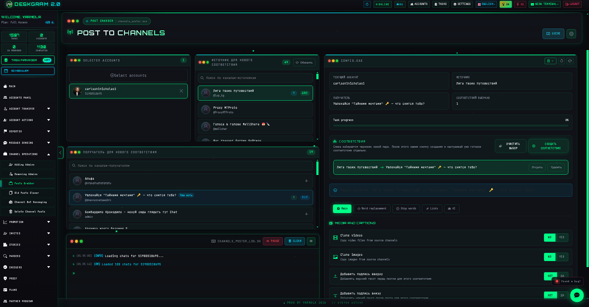
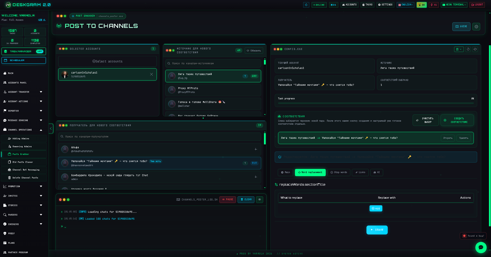
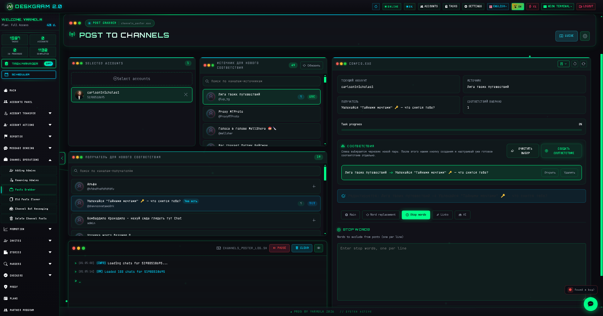
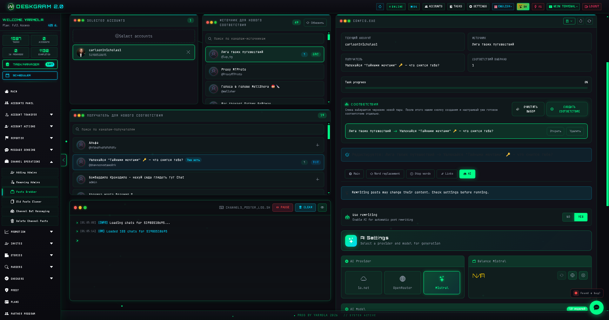

# Telegram Post Grabber with Deskgram 2

Post Grabber in Deskgram 2 helps pull content from Telegram channels and rebuild new publication routes between source and target channels. This module is useful when content should not only be reused, but also repackaged through media settings, top and bottom captions, replacements, link rules, and AI rewriting.

[Deskgram 2 Hub](https://github.com/Deskgram-2/deskgram-2-telegram-automation-en) · [Website](https://deskgram2.com/) · [Telegram Bot](https://t.me/DG2welcomebot) · [Web Preview](https://deskgram2.com/web-preview?path=%2Fapp-demo%2F&lang=en)

## Interactive Web Preview

Try the module interface in the browser: [Open web preview](https://deskgram2.com/web-preview?path=%2Fapp-demo%2Ffunctions%2Fchannel_poster&lang=en)

This makes it easier to inspect mapping cards, media controls, and AI options before you start a live content rebuild route.

## Screenshots

## About the module

| Parameter | What is inside |
|---|---|
| Main task | Grab and rebuild Telegram posts between channels |
| Important blocks | Mappings, media settings, top/bottom captions, replacements, links, AI |
| Useful for | Content networks, repackaging channel materials, adaptive reuse |
| Related sections | Old Posts Cloner, Task Manager, Settings, Hub |

## What it can do

- build source -> target pairs for separate content routes;
- clone videos and images depending on the selected rules;
- add top and bottom text blocks around the post body;
- apply replacements, stop words, link settings, and AI rewriting;
- keep several configurable mappings inside one working scenario.

## Quick start

1. Pick the account and refresh the channel lists.
2. Build the first source -> target mapping.
3. Configure media rules, captions, replacements, and links.
4. Enable AI rewriting if the text should be adapted further.
5. Start the module and review the result through logs and progress.

## Where this module fits best

- [Old Posts Cloner](https://github.com/Deskgram-2/telegram-channel-post-cloner-deskgram-en), if you need a simpler archive reuse route;
- [Task Manager](https://github.com/Deskgram-2/telegram-task-manager-deskgram-en), if content grabbing should live inside a broader execution stack;
- [Automation Settings](https://github.com/Deskgram-2/telegram-automation-settings-deskgram-en), if the workflow depends on shared AI and platform settings;
- [Channel Search](https://github.com/Deskgram-2/telegram-channel-search-deskgram-en), if you also build discovery and source research around the content layer.

## When it is especially useful

- when the same source channel should feed several targets with different packaging rules;
- when media and caption handling matters as much as the main post text;
- when content should be transformed before it reaches the next publication layer;
- when a reusable content source becomes part of a larger distribution flow.

## What to choose: Post Grabber or Old Posts Cloner

| If your goal is | Better fit |
|---|---|
| Rebuild content with media, caption, and AI control | [Post Grabber](https://github.com/Deskgram-2/telegram-channel-post-grabber-deskgram-en) |
| Reuse older posts through a lighter source-target route | [Old Posts Cloner](https://github.com/Deskgram-2/telegram-channel-post-cloner-deskgram-en) |
| Build a more configurable transformation layer | Post Grabber |
| Relaunch archive content faster | Old Posts Cloner |

## Related repositories

- [Deskgram 2 Hub](https://github.com/Deskgram-2/deskgram-2-telegram-automation-en)
- [Old Posts Cloner](https://github.com/Deskgram-2/telegram-channel-post-cloner-deskgram-en)
- [Task Manager](https://github.com/Deskgram-2/telegram-task-manager-deskgram-en)
- [Automation Settings](https://github.com/Deskgram-2/telegram-automation-settings-deskgram-en)
- [Channel Search](https://github.com/Deskgram-2/telegram-channel-search-deskgram-en)

## FAQ

### Can I inspect the interface before installing anything?

Yes. The browser preview is linked above, so you can inspect mappings and configuration flow first.

### Is this only about copying text from one channel to another?

No. The module is more useful when content should be adapted through media controls, text additions, filtering rules, and AI rewriting instead of being copied as-is.
